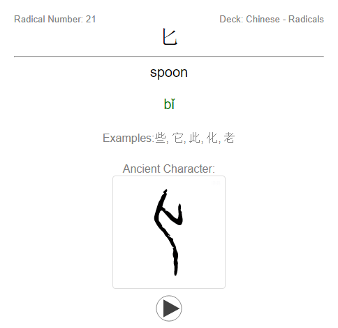

# Anki Chinese Radicals Deck+

This is an Anki flashcards deck for learning the Chinese Radicals.
The Radicals are the building blocks for the Chinese Characters, but can also be found in Japanese and Korean Language.
The cool thing is, if you have studied the radicals you can guess the meaning and pronunciation of a character, though you have not learned them yet.

You can also build up mnemonics for Chinese characters from it. For example for the character *好* which means *good*:

```
女 + 子 = 好

Meaning:
woman + child = good, well (好 hǎo)

"When a woman sticks to her child, it is good"
```

The Deck is automatically generated from a Python script. You can have a look at the project at [https://github.com/jay-pee/Anki-Chinese-Radicals-Deck-Plus](https://github.com/jay-pee/Anki-Chinese-Radicals-Deck-Plus)

## Fields

- Hanzi (Character)
- Pinyin (Romanization)
- English (Definition)
- Kanji Radical Number
- Alternatives (Radicals have sometimes multiple glyphs)
- Sound (TTS Pronunciation)
- Ancient Character (Image from zdic.net)
- Examples (Characters where the Radical is used)

## Example Card



## Get the most out of this deck

If you want to learn the radicals as fast as possible I would advice you to add some addition information to this cards.
Here are some tips of what you can do:

- Add images, that you have looked up and you think it fits best to the character to the deck.
- Add an annotation that says something about the radical: How does it look like? Does the ancient scripture reminds you on something?
- ...

## Download the deck

- You can download the deck from [here](https://github.com/jay-pee/Anki-Chinese-Radicals-Deck-Plus/blob/master/decks/Chinese-Radicals.apkg) at github.com or the shared deck from [here](https://ankiweb.net/shared/info/1732259414) at ankiweb.net

## Build from Source

1. Download the repository
2. Install the requirements with `pip install -r requirments.txt`
3. Install the required node module with `npm install hanzi` (will soon be substituted)
4. Open a shell in the repository folder and run the main script (`python main.py`)

## Contribute

If you have any suggestions how to improve the cards, you are welcome to write an [github issue](https://github.com/jay-pee/Anki-Chinese-Radicals-Deck-Plus/issue) or directly edit the scripts and make a pull request! Slight word of warning: This project is still in the rapid prototyping phase. So don't expect to much from the code quality. Also PRs for typos in the readme are welcome.

## Todos

- [x] Add Kanji Radical Number
- [x] Add Sound
- [x] Get ancient scriptures
- [x] Add colored Pinyin
- [ ] Stroke order with https://github.com/chanind/hanzi-writer
- [ ] Add Pictures maybe from https://writecantonese8.files.wordpress.com/2012/10/35670726-new-chinese-radical-full.pdf or google IMG
- [ ] Add CI/CD Workflow
- [ ] Implement  Mnemonic like https://www.zerotohero.ca/#/en/zh/dictionary/hsk-cedict/%E5%80%91,men,0 

## Acknowledgment

Thank you to ccdb.hemiola.com (API for Chinese Characters), zdic.net (for the Ancient Scripture Images) HanziJS (for the Examples), translate.google.com (for the sounds) and the python pinyin module.
